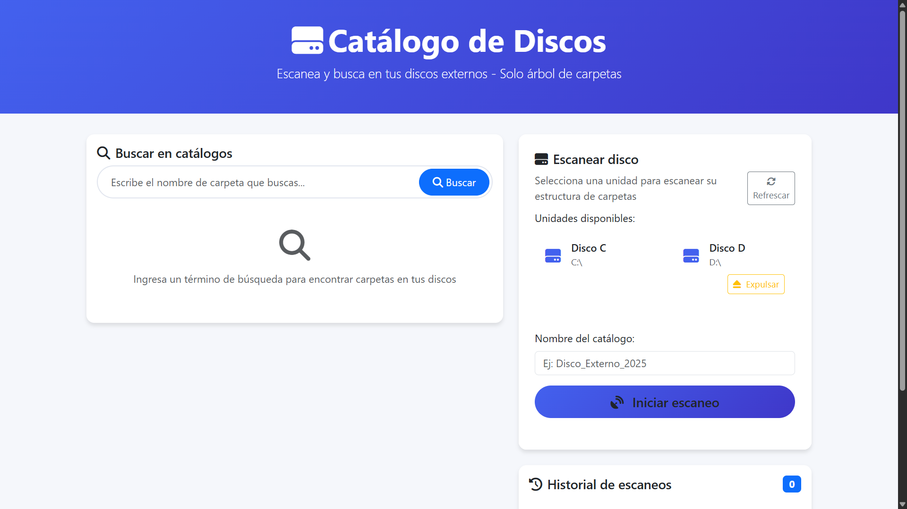

# ScanFolder

Una aplicación web desarrollada en Python con Flask que permite escanear unidades de almacenamiento (discos duros, SSDs, pendrives) para catalogar su estructura de directorios y realizar búsquedas de carpetas en todos los discos escaneados, incluso cuando no están conectados.

## ¿Por qué ScanFolder?

ScanFolder es la solución perfecta para usuarios que manejan grandes volúmenes de datos distribuidos en múltiples dispositivos. Con su **arquitectura SQLite moderna**, ofrece:

### 🚀 **Rendimiento Superior**
- **Búsquedas instantáneas** con índices optimizados
- **Consultas SQL eficientes** vs. lectura secuencial de archivos
- **Escalabilidad** para manejar millones de directorios sin degradación

### 🛡️ **Integridad de Datos**
- **Transacciones ACID** garantizan consistencia
- **Claves foráneas** con validación automática
- **Base de datos centralizada** elimina problemas de corrupción

### 📈 **Arquitectura Escalable**
- **Un solo archivo** de base de datos vs. múltiples archivos JSON
- **Crecimiento automático** y gestión eficiente del espacio
- **Concurrencia segura** para múltiples operaciones

## Descripción

ScanFolder es ideal para fotógrafos, editores de video, administradores de sistemas y cualquier persona que necesite localizar rápidamente directorios específicos sin tener todos los dispositivos conectados simultáneamente.

## Características

- 🔍 **Escaneo de múltiples unidades**: Compatible con discos duros, SSDs y dispositivos USB
- 📁 **Catalogación automática**: Genera catálogos JSON de la estructura de directorios
- 🔎 **Búsqueda rápida**: Busca carpetas en todos los catálogos generados
- 📊 **Historial de escaneos**: Mantiene un registro de todos los dispositivos escaneados
- 🖥️ **Interfaz web intuitiva**: Interfaz de usuario moderna con Bootstrap
- 💾 **Identificación única**: Utiliza números de serie de volumen para identificar dispositivos
- 🌐 **Multiplataforma**: Soporte para Windows, Linux y macOS
- ⏱️ **Búsqueda offline**: Encuentra carpetas sin tener los dispositivos conectados

## Instalación

### Prerrequisitos

- **Python 3.7+** (Recomendado: Python 3.11 o superior)
- **pip** (gestor de paquetes de Python)
- **Git** (para clonar el repositorio)

### Instalación Rápida

1. **Clonar el repositorio**:
   ```bash
   git clone https://github.com/v8paulofelix/ScanFolder.git
   cd ScanFolder
   ```

2. **Crear entorno virtual** (altamente recomendado):
   ```bash
   # Windows
   python -m venv .venv
   .venv\Scripts\activate

   # Linux/macOS
   python -m venv .venv
   source .venv/bin/activate
   ```

3. **Instalar dependencias**:
   ```bash
   pip install -r requirements.txt
   ```

4. **Verificar instalación**:
   ```bash
   python -c "from app import app; print('✅ Instalación exitosa')"
   ```

### Instalación para Desarrollo

Si planeas contribuir al proyecto:

```bash
# Instalar dependencias de desarrollo
pip install -r requirements.txt
pip install pytest pytest-cov black flake8

# Verificar que las pruebas pasan
python -m pytest

# Formatear código
black . --line-length 88
```

## Uso

### Inicio Rápido

1. **Activar entorno virtual** (si no está activo):
   ```bash
   # Windows
   .venv\Scripts\activate
   
   # Linux/macOS
   source .venv/bin/activate
   ```

2. **Iniciar la aplicación**:
   ```bash
   python app.py
   ```
   
   O usando Flask CLI:
   ```bash
   flask run
   ```

3. **Acceder a la aplicación**:
   - Abre tu navegador en: `http://localhost:5000`
   - La base de datos SQLite se creará automáticamente en `scandata.db`

### Guía de Uso

#### 🔍 **Escanear un Disco**
1. Selecciona la unidad desde el menú desplegable
2. Opcionalmente, personaliza el nombre del catálogo
3. Haz clic en **"Iniciar Escaneo"**
4. Espera a que se complete (tiempo variable según el tamaño del disco)
5. El catálogo se guarda automáticamente en la base de datos SQLite

#### 🔎 **Buscar Carpetas**
1. Introduce el nombre de la carpeta en el campo de búsqueda
2. Los resultados se muestran instantáneamente
3. Ve información completa: disco, ruta, fecha de escaneo
4. **Funciona incluso con discos desconectados**

#### 📊 **Gestionar Historial**
1. Ve todos los discos escaneados en la tabla principal
2. **Renombrar**: Haz doble clic en el nombre del catálogo
3. **Actualizar**: Re-escanea un disco conectado
4. **Eliminar**: Borra un catálogo del historial

### Arquitectura Técnica

```
ScanFolder/
├── app.py              # 🌐 Servidor Flask (rutas web)
├── storage.py          # 🗄️ Capa de datos SQLite
├── scandata.db         # 📊 Base de datos (auto-creada)
├── templates/          # 🎨 Interfaz web
└── requirements.txt    # 📦 Dependencias
```

**Base de Datos SQLite:**
- `scans`: Metadatos de discos escaneados
- `directories`: Índice de todos los directorios encontrados
- **Relación 1:N** con claves foráneas y CASCADE

## Capturas de Pantalla

### 🖥️ Interfaz Principal


*Interfaz web moderna de ScanFolder mostrando las opciones de escaneo, búsqueda instantánea y gestión de catálogos de discos*

## Estructura del Proyecto

```
ScanFolder/
├── app.py              # Aplicación principal Flask
├── templates/
│   └── index.html      # Interfaz de usuario
├── catalogos/          # Catálogos generados (no incluidos en el repo)
├── docs/
│   └── informes/       # Documentación del proyecto
├── scan_history.json   # Historial de escaneos (no incluido en el repo)
└── requirements.txt    # Dependencias de Python
```

## Contribuir

Las contribuciones son bienvenidas. Por favor:

1. Haz un fork del proyecto
2. Crea una rama para tu feature (`git checkout -b feature/AmazingFeature`)
3. Haz commit de tus cambios (`git commit -m 'Add some AmazingFeature'`)
4. Push a la rama (`git push origin feature/AmazingFeature`)
5. Abre un Pull Request

## Roadmap

- [ ] Migración a base de datos SQLite
- [ ] Mejoras en la búsqueda avanzada con filtros
- [ ] Exportación de resultados a CSV/TXT
- [ ] Estadísticas detalladas de catálogos
- [ ] Interfaz de usuario mejorada con paginación
- [ ] API REST para integración con otras aplicaciones

## Licencia

Este proyecto está bajo la Licencia MIT. Ver el archivo [LICENSE](LICENSE) para más detalles.

## Autor

**Paulo Felix** - [@v8paulofelix](https://github.com/v8paulofelix)

## Soporte

Si encuentras algún problema o tienes sugerencias, por favor abre un [issue](https://github.com/v8paulofelix/ScanFolder/issues) en GitHub.
